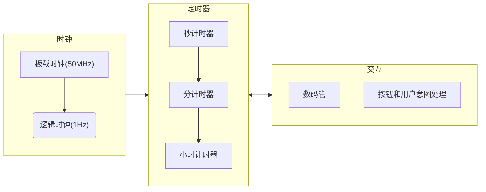

# Timer
Timer Logics written in Verilog | My HDL Course Task

这是一个定时器项目, 功能如下:

- 正计时
- 倒计时

总体结构如下:

```mermaid
graph LR

subgraph Clock["时钟"]
ExtClk["板载时钟(50MHz)"] --> TickClk("逻辑时钟(1Hz)")
end

subgraph Timer["定时器"]
Sec["秒计时器"] -->
Min["分计时器"] -->
Hour["小时计时器"]
end

subgraph Interface["交互"]
    Seg["数码管"]
    Btns["按钮和用户意图处理"]
end

Clock --> Timer <--> Interface
```