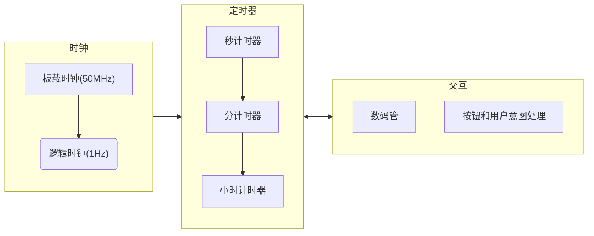
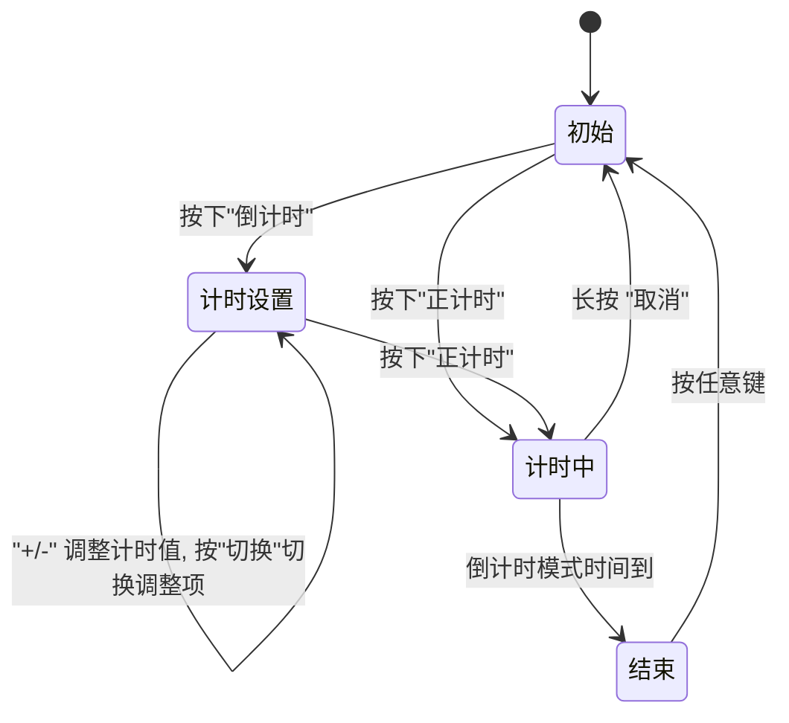

# Timer
Timer Logics written in Verilog | My HDL Course Task

这是一个定时器项目, 功能如下:

- 正计时
- 倒计时

总体结构如下:

```mermaid
graph LR

subgraph Clock["时钟"]
ExtClk["板载时钟(50MHz)"] --> TickClk("逻辑时钟(1Hz)")
end

subgraph Timer["定时器"]
Sec["秒计时器"] -->
Min["分计时器"] -->
Hour["小时计时器"]
end

subgraph Interface["交互"]
    Seg["数码管"]
    Btns["按钮和用户意图处理"]
end

Clock --> Timer <--> Interface
```

## 交互方式

从左到右四个按钮: 

- BTN0: 确认/正计时
- BTN1: 取消/切换/倒计时
- BTN2: +
- BTN3: -

交互逻辑:

```mermaid
stateDiagram-v2

    state "初始" as Initial
    state "计时设置" as TimeSetting
    state "计时中" as Counting
    state "结束" as Done
    [*] --> Initial
    Initial --> TimeSetting: 按下"倒计时"
    Initial --> Counting: 按下"正计时"

    TimeSetting --> TimeSetting: "+/-" 调整计时值, 按"切换"切换调整项
    TimeSetting --> Counting: 按下"正计时"

    Counting --> Done: 倒计时模式时间到
    Counting --> Initial: 长按 "取消"
    Done --> Initial: 按任意键

```